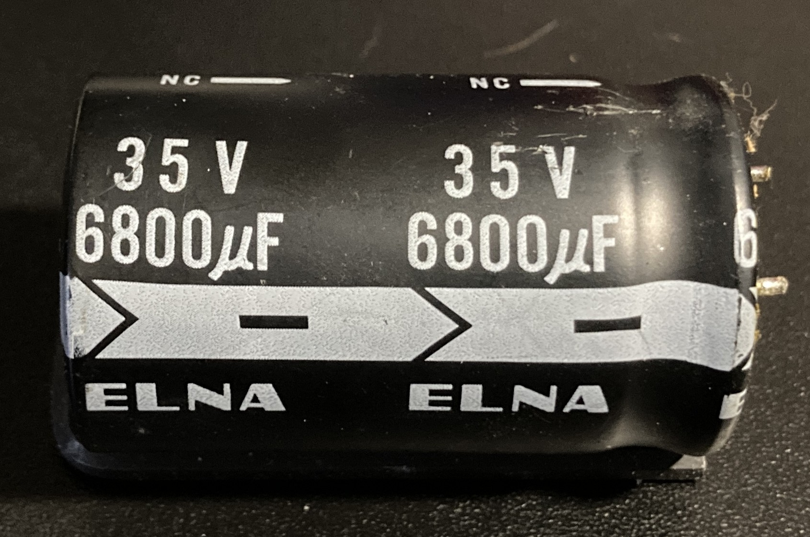
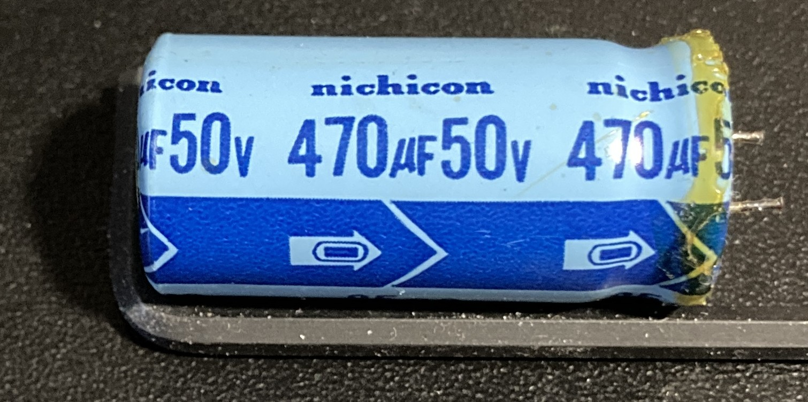

# Yamaha CR-420

## Electrolytics

My 1977-vintage receiver had five types of electrolytic capacitors installed; I'm not certain on the manufacturer of two of them. The first is primarly a lilac color, with a dark purple stripe indicating the negative lead:

There are also a couple of Elna-manufactured capacitors, orange in color, with a black stripe marking the negative lead. In the parts list and diagrams these are referred to as "RB" capacitors:

The two large black capacitors near the transformer are also Elna parts:

Next, there are a small number of blue capacitors with a black stripe marking the negative lead, seemingly from the same manufacturer as the purple parts. The diagrams refer to these as "low leakage electrolytic capacitors"; in the parts list they are named "MS" capacitors:

Finally, my board had a small number of Nichicon capacitors, light blue in color with a dark blue stripe. One of these capacitors matched the schematic, but the other five do not seem to line up with anything in my copy of the service manual:

The orange Elna/RB capacitors are found at the back of the tuner board, while the blue MS capacitors are adjacent to the tuning mechanism:

## Parts

Except where otherwise noted, all original parts are the purple capacitor type. Measurements were made with relatively cheap calipers, and capacitors can swell over time, so none of the values should be taken as an exact reference. Components where the installed part in my receiver did not match the diagrams are called out as mismatched. The Yamaha part numbers given match the schematic's rating where it differs from the installed capacitor.

### Tuner Board

ID | Installed | Mismatch | Schematic | Diameter | Notes
--- | --- | --- | --- | --- | --- 
C104 | 0.47uF 50V | | 0.47uF 50V | 5.25
C106 | 1uF 50V | | 1uF 50V | 5.25
C113 | 1uF 50V | | 1uF 50V | 5.2
C117 | 1uF 50V | X | 4.7uF 25V | 5.2 | Installed part appears to be a "MS" capacitor but is not marked as such in the diagrams
C118 | 1uF 50V | | 1uF 50V | 5.25
C119 | 10uF 16V | | 10uF 16V | 5.3
C120 | 10uF 16V | | 10uF 16V | 5.3
C121 | 10uF 16V | | 10uF 16V | 5.25
C122 | 220uF 16V | | 220uF 16V | 10.38
C125 | 10uF 16V | | 10uF 16V | 5.3
C126 | 0.22uF 50V | | 0.22uF 50V | 5.2
C128 | 1uF 50V | | 1uF 50V | 5.2
C130 | 220uF 16V | | 220uF 16V | 10.3
C136 | 0.47uF 50V | | 0.47uF 50V | 5.2
C137 | 0.47uF 50V | | 0.47uF 50V | 5.2
C138 | 47uF 16V | X | 4.7uF 16V | 8.2 | Parts list has capacitors matching the installed part, but not the schematic
C139 | 100uF 10V | X | 100uF 6.3V | 8.2 | The installed part has a higher voltage rating (not an issue); neither rating is found in the parts list
C140 | 10uF 16V | | 10uF 16V | 5.2
C145 | 10uF 16V | | 10uF 16V | 5.1
C149 | 1uF 50V | | 1uF 50V | 5.15
C201 | 22uF 16V | X | 10uF 25V | 6.3 | Orange Elna or "RB", left Phono input circuit
C202 | 22uF 16V | | | 6.3 | No spec on diagram, right Phono input circuit
C213 | 2.2uF 50V | | 2.2uF 50V | 5.2 | Low leakage or "MS", left Phono input circuit
C214 | 2.2uF 50V | | | 5.2 | No spec on diagram, right Phono input circuit
C215 | 220uF 6.3V | | 220uF 6.3V | 10.2 | Left Phono input circuit to ground
C216 | 220uF 6.3V | | | 10.3 | No spec on diagram, right Phono input circuit to ground
C217 | 10uF 25V | | 10uF 25V | 6.4

### Tone Board

ID | Installed | Mismatch | Schematic | Detail | Diameter | Notes
--- | --- | --- | --- | --- | --- | ---
C301 | 10uF 16V | | 10uF 16V | Low leakage | | Left channel
C302 | 10uF 16V | | 10uF 16V | Low leakage | | No spec but right channel to C301
C307 | 47uF 10V | X | 47uF 6.3V | | | Left channel
C308 | 47uF 10V | X | 47uF 6.3V | | | No spec but right channel to C307
C309 | 10uF 25V | | 10uF 25V | RB | | Left channel
C310 | 10uF 25V | | 10uF 25V | RB | | No spec but right channel to C309
C311 | 10uF 16V | | 10uF 16V | Low leakage | | Left channel
C312 | 10uF 16V | | 10uF 16V | Low leakage | | No spec but right channel to C311
C325 | 10uF 16V | | 10uF 16V

### Main Board

ID | Installed | Mismatch | Schematic | Detail | Diameter | Notes
--- | --- | --- | --- | --- | --- | ---
C403 | 1uF 50V | | 1uF 50V | Low leakage | | Left channel
C404 | 1uF 50V | | 1uF 50V | Low leakage | | No spec but right channel to C403
C407 | 47uF 10V | X | 47uF 6.3V | Low leakage | | Left channel
C408 | 47uF 10V | X | 47uF 6.3V | Low leakage | | No spec but right channel to C407
C411 | 33uF 25V | | 33uF 25V | | | Left channel
C412 | 33uF 25V | | 33uF 25V | | | No spec but right channel to C411
C417 | 1uF 50V | | 1uF 50V | | | Left channel
C418 | 1uF 50V | | 1uF 50V | | | No spec but right channel to C417
C507 | 6800uF 35V | | 6800uF 35V
C508 | 6800uF 35V | | 6800uF 35V
C509 | 33uF 50V | | 33uF 50V | | | Not found in parts list
C510 | 33uF 16V | | 33uF 16V
C511 | 470uF 50V | | 470uF 50V
C512 | 47uF 50V | | 47uF 50V
C513 | 100uF 25V | | 100uF 25V
C514 | 22uF 25V | | 22uF 25V
C515 | 100uF 16V | | 100uF 16V
C516 | 220uF 16V | | 220uF 16V
C517 | 10uF 35V | | 10uF 35V
C518 | 10uF 16V | | 10uF 16V
C519 | 100uF 35V | | 100uF 35V
C520 | 100uF 35V | | 100uF 35V
--- | 4.7uF 50V | | | | | Located between TR418 and TR416, not on diagram
--- | 3.3uF 50V | | | | | Located between TR418 and TR416, not on diagram or parts list
--- | 3.3uF 50V | | | | | Located between TR418 and TR416, not on diagram or parts list
--- | 3.3uF 50V | | | | | Located between TR417 and TR415, not on diagram or parts list
--- | 3.3uF 50V | | | | | Located between TR417 and TR415, not on diagram or parts list

### Part Selection

I ordered all of my parts from DigiKey, my go-to electronics supplier. Many/most of these parts should also be available from Mouser, Newark, etc. I used the following criteria to select parts, starting from the top and selecting the first available:

1. In stock at DigiKey and not sold by a third-party "marketplace seller"

2. Matching parts from the Nichicon UES "Muse" line

3. Matching parts from [Nichicon's miniature lines designed for audio](https://www.nichicon.com/en-us/products/aluminum-electrolytic-capacitors/miniature-aluminum-electrolytic-capacitors/for-audio-equipment/)

4. Matching parts from [Nichicon's large can lines designed for audio](https://www.nichicon.com/en-us/products/aluminum-electrolytic-capacitors/large-can-aluminum-electrolytic-capacitors/for-audio-equipment/)

5. Matching parts from [Nichicon's high reliability lines](https://www.nichicon.com/en-us/products/aluminum-electrolytic-capacitors/miniature-aluminum-electrolytic-capacitors/high-reliability-type/)

6. Matching parts from [Nichicon's standard lines](https://www.nichicon.com/en-us/products/aluminum-electrolytic-capacitors/miniature-aluminum-electrolytic-capacitors/standard-type/)

7. Any other available Japanese manufacturer

#### Installed Parts Totals

Only parts that do not match the schematic have a replacement Nichicon part listed here.

Rating | Diameter | Length | Count | Replacement
--- | --- | --- | --- | ---
220uF 6.3V | 10.23 | 12.72 | 2
47uF 10V | | | 4 | UES1A470MEM
100uF 10V | 8.28 | 12.13 | 1 | UES1A101MPM
10uF 16V | 5.17 | 17.19 | 12
22uF 16V | 6.22 | 12.02 | 2 | UKT1C220MDD
33uF 16V | | | 1
47uF 16V | 8.26 | 11.72 | 1 | UES1C470MPM
100uF 16V | | | 1
220uF 16V | 10.24 | 16.43 | 3
10uF 25V | 6.51 | 11.71 | 3
22uF 25V | | | 1
33uF 25V | | | 2
100uF 25V | | | 1
10uF 35V | | | 1
100uF 35V | | | 2
6800uF 35V | | | 2
0.22uF 50V | 5.23 | 11.43 | 1
0.47uF 50V | 5.18 | 11.30 | 3
1uF 50V | 5.19 | 11.07 | 10
2.2uF 50V | 5.23 | 11.09 | 2
3.3uF 50V | | | 4 | UDB1H3R3MPM
4.7uF 50V | | | 1 | UDB1H4R7MPM
33uF 50V | | | 1
47uF 50V | | | 1
470uF 50V | | | 1

#### Schematic Parts Totals

Rating | Count | Replacement | Note
--- | --- | --- | ---
47uF 6.3V | 4| UPS0J470MDD
100uF 6.3V | 1 | UES0J101MPM
220uF 6.3V | 2 | UES0J221MPM
4.7uF 16V | 1 | Panasonic ECE-A1CKN4R7I
10uF 16V | 12 | UPW1C100MDD
33uF 16V | 1 | UES1C330MEM
100uF 16V | 1 | UES1C101MPM
220uF 16V | 3 | UES1C221MPM
4.7uF 25V | 1 | UPW1E4R7MDD
10uF 25V | 5 | UPS1E100MDD
22uF 25V | 1 | UKT1E220MDD
33uF 25V | 2 | UES1E330MPM
100uF 25V | 1 | UES1E101MPM
10uF 35V | 1 | UEP1V100MDD
100uF 35V | 2 | UES1V101MPM
6800uF 35V | 2 | LKS1V682MESZ | The replacement part is only 22mm in diameter and 40mm in length, and is a snap-in design
0.22uF 50V | 1
0.47uF 50V | 3 | UVP1HR47MDD
1uF 50V | 9 | UDB1H010MPM
2.2uF 50V | 2 | UDB1H2R2MPM
33uF 50V | 1 | UES1H330MPM
47uF 50V | 1 | UES1H470MPM
470uF 50V | 1 | UKW1H471MHD

### Yamaha Part Numbers

Capacitance | Voltage | Part Number | Note
--- | --- | --- | ---
47uF | 6.3V | 420000FJ417470
47uF | 6.3V | 420000FZ000830 | MS
220uF | 6.3V | 420000FJ318220
10uF | 16V | 420000FJ437100
10uF | 16V | 420000FZ000470 | MS
33uF | 16V | 420000FJ337330
100uF | 16V | 420000FJ338100
220uF | 16V | 420000FJ338220
10uF | 25V | 420000FJ447100
10uF | 25V | 420000FZ000980 | RB
22uF | 25V | 420000FJ447220
33uF | 25V | 420000FJ347330
100uF | 25V | 420000FJ348100
10uF | 35V | 420000FJ457100
100uF | 35V | 420000FJ358100
6800uF | 35V | 420000FM459680
0.22uF | 50V | 420000FJ465220
0.47uF | 50V | 420000FJ465470
1uF | 50V | 420000FJ466100
1uF | 50V | 420000FZ000570 | MS
2.2uF | 50V | 420000FZ000900 | MS
47uF | 50V | 420000FJ367470
470uF | 50V | 420000FJ168470

## Discrepancies

- The main board in my receiver had 5 capacitors that did not appear to match any of the schematic. Two of them are on the left side, between TR415 and TR417. The other three are on the right between TR418 and TR416. All of these capacitors are light blue in color and manufactured by Nichicon; they appear to be from the same line as C511.

- The large 6800uF capacitors are not available as exact matches from modern parts. Newer capacitors are much smaller for the rated capacitance, and such large capacitors are generally not available with radial leads. I selected smaller, snap-in parts, then soldered lead wires to them and secured them with adhesive zip tie mounts behind the transformer. It should also be possible to make a kind of snap-in capacitor adapter board (something like [this](https://www.ebay.com/itm/126708135489)), but I didn't spend the time for just two parts.

## Tips

- The mounting plates for the two I/O selector switches do not have to be desoldered from the board; I only discovered this after removing the first one. Simply loosen the nut on the switch shaft, desolder the small pins below the switch body, and the switch will lift free from the board, leaving the plate in place.

- Only the two I/O switches can be disassembled; the potentiometers for bass, treble, and loudness, and the volume and balance potentiometer, have parts riveted in place.