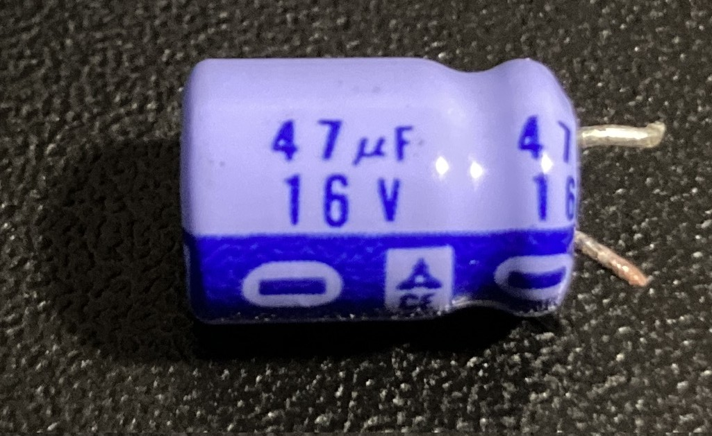
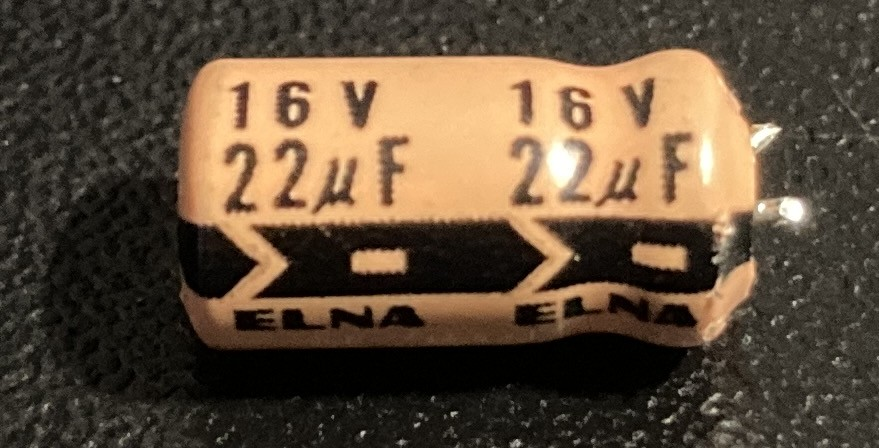
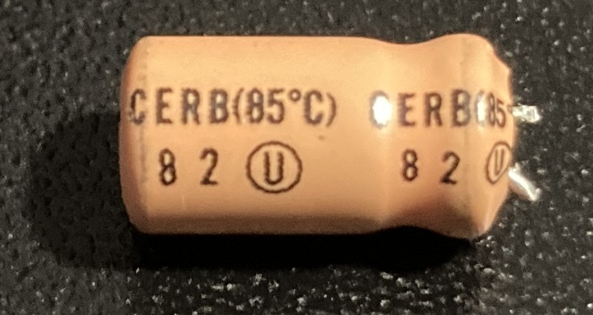
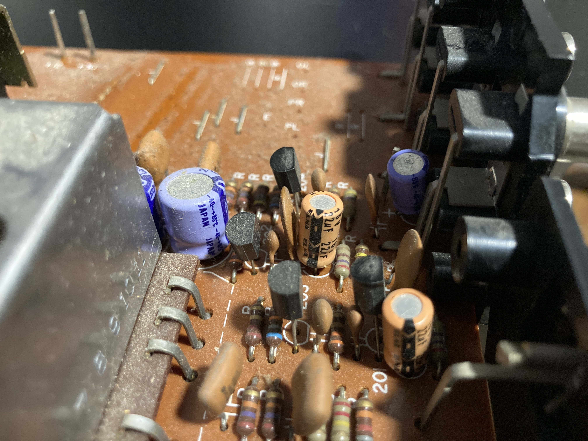
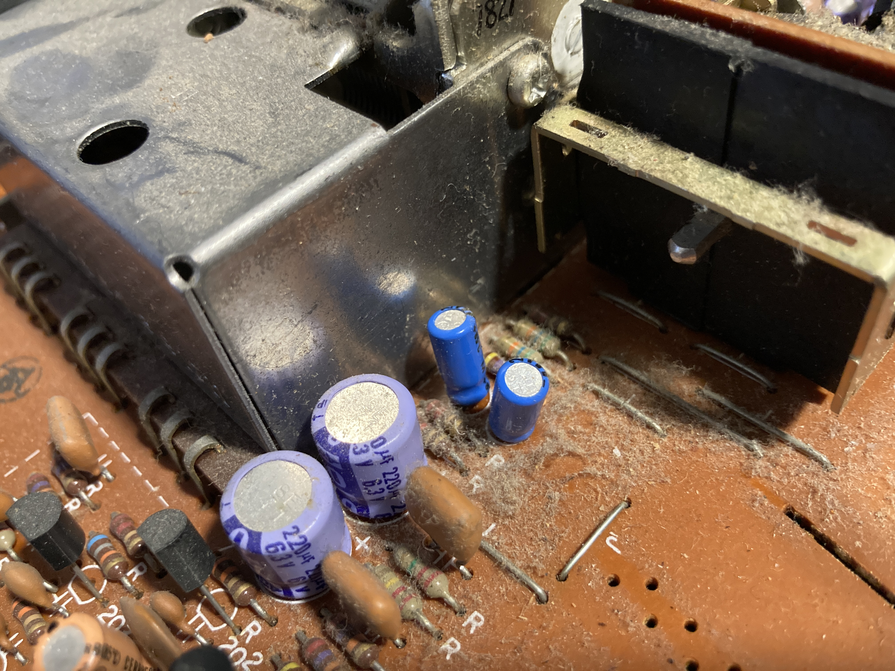

# Yamaha CR-420

## Electrolytics

My 1977-vintage receiver had three types of electrolytic capacitors installed; I'm not certain on the manufacturer of two of them. The first is primarly a lilac color, with a dark purple stripe indicating the negative lead:

There are also a couple of Elna-manufactured capacitors, orange in color with a black stripe marking the negative lead. In the parts list and diagrams these are referred to as "RB" capacitors:

Finally, there are a small number of blue capacitors with a black stripe marking the negative lead, seemingly from the same manufacturer as the purple parts. The diagrams refer to these as "low leakage electrolytic capacitors"; in the parts list they are named "MS" capacitors:

The orange Elna/RB capacitors are found at the back of the tuner board, while the blue MS capacitors are adjacent to the tuning mechanism:

## Parts

Except where otherwise noted, all original parts are the purple capacitor type. Measurements were made with relatively cheap calipers, and capacitors can swell over time, so none of the values should be taken as an exact reference. Components where the installed part in my receiver did not match the diagrams are called out as mismatched. The Yamaha part numbers given match the schematic's rating where it differs from the installed capacitor.

### Tuner Board

ID | Installed | Mismatch | Schematic | Yamaha Part # | Diameter | Replacement | Notes
--- | --- | --- | --- | --- | --- | --- | ---
C104 | 0.47uF 50V | | 0.47uF 50V | 420000FJ465470 | 5.25 | Nichicon UVP1HR47MDD
C106 | 1uF 50V | | 1uF 50V | 420000FJ466100 | 5.25 | Nichicon UDB1H010MPM
C113 | 1uF 50V | | 1uF 50V | 420000FJ466100 | 5.2 | Nichicon UDB1H010MPM
C117 | 1uF 50V | X | 4.7uF 25V | 420000FJ446470 | 5.2 | | Installed part appears to be a "MS" capacitor but is not marked as such in the diagrams
C118 | 1uF 50V | | 1uF 50V | 420000FJ466100 | 5.25 | Nichicon UDB1H010MPM
C119 | 10uF 16V | | 10uF 16V | 420000FJ437100 | 5.3 | Nichicon UPW1C100MDD
C120 | 10uF 16V | | 10uF 16V | 420000FJ437100 | 5.3 | Nichicon UPW1C100MDD
C121 | 10uF 16V | | 10uF 16V | 420000FJ437100 | 5.25 | Nichicon UPW1C100MDD
C122 | 220uF 16V | | 220uF 16V | 420000FJ338220 | 10.38
C125 | 10uF 16V | | 10uF 16V | 420000FJ437100 | 5.3 | Nichicon UPW1C100MDD
C126 | 0.22uF 50V | | 0.22uF 50V | 420000FJ465220 | 5.2
C128 | 1uF 50V | | 1uF 50V | 420000FJ466100 | 5.2 | Nichicon UDB1H010MPM
C130 | 220uF 16V | | 220uF 16V | 420000FJ338220 | 10.3
C136 | 0.47uF 50V | | 0.47uF 50V | 420000FJ465470 | 5.2 | Nichicon UVP1HR47MDD
C137 | 0.47uF 50V | | 0.47uF 50V | 420000FJ465470 | 5.2 | Nichicon UVP1HR47MDD
C138 | 47uF 16V | X | 4.7uF 16V | | 8.2 | Nichicon UES1C470MPM | Parts list has capacitors matching the installed part, but not the schematic
C139 | 100uF 10V | X | 100uF 6.3V | | 8.2 | Nichicon UES1A101MPM | The installed part has a higher voltage rating (not an issue); neither rating is found in the parts list
C140 | 10uF 16V | | 10uF 16V | 420000FJ437100 | 5.2 | Nichicon UPW1C100MDD
C145 | 10uF 16V | | 10uF 16V | 420000FJ437100 | 5.1 | Nichicon UPW1C100MDD
C149 | 1uF 50V | | 1uF 50V | 420000FJ466100 | 5.15 | Nichicon UDB1H010MPM
C201 | 22uF 16V | X | 10uF 25V | 420000FZ000980 | 6.3 | Nichicon UKT1C220MDD | Elna or "RB", right Phono input circuit
C202 | 22uF 16V | | | | 6.3 | Nichicon UKT1C220MDD | No spec on diagram, left Phono input circuit
C213 | 2.2uF 50V | | 2.2uF 50V | 420000FZ000900 | 5.2 | Nichicon UDB1H2R2MPM | Low leakage or "MS", right Phono input circuit
C214 | 2.2uF 50V | | | | 5.2 | Nichicon UDB1H2R2MPM | No spec on diagram, left Phono input circuit
C215 | 220uF 6.3V | | 220uF 6.3V | 420000FJ318220 | 10.2 | Nichicon UES0J221MPM | Right Phono input circuit to ground
C216 | 220uF 6.3V | | | | 10.3 | Nichicon UES0J221MPM | No spec on diagram, left Phono input circuit to ground
C217 | 10uF 25V | | 10uF 25V | 420000FJ447100 | 6.4

#### Totals

Rating | Quantity
--- | ---
0.22uF 50V | 1
0.47uF 50V | 3
1uF 50V | 5
2.2uF 50V | 1
4.7uF 16V | 1
4.7uF 25V | 1
10uF 16V | 6
10uF 25V | 2
100uF 6.3V | 1
220uF 6.3V | 1
220uF 16V | 2
